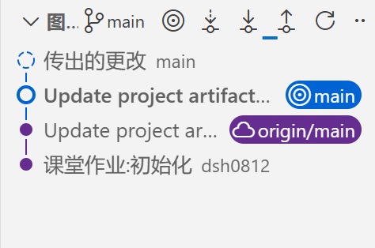

# AI 时代经济学研究工具与方法 — 纸质提交材料

---

## 封面信息

| 项目                                 | 内容                                                                                                                                     |
| :----------------------------------- | :--------------------------------------------------------------------------------------------------------------------------------------- |
| **姓名**                       | 刁绍华                                                                                                                                   |
| **学号**                       | 161584118                                                                                                                                |
| **GitHub 仓库链接**            | https://github.com/dsh0812/copy-project.git                                                                                              |
| **一句话说明你用 AI 做了什么** | 本研究利用 AI 工具系统执行了 11 项 DID 稳健性检验（涵盖常规与主题特定检验），并开发了一个可迁移的稳健性检验 Skill 与一个综合评估 Agent。 |
| **提交日期**                   | 2026.08.31                                                                                                                               |

### Git 历史截图

---

## 一、识别目标

> 用 AI 之前，先想清楚要估计什么。这是"先想后问"的习惯，不是研究设计作业。

| 项目            | 我的回答                                                                                                                                                                                                                                                                                                                                                                                                                                                                                                                                                                                                                                                                                                                  |
| :-------------- | :------------------------------------------------------------------------------------------------------------------------------------------------------------------------------------------------------------------------------------------------------------------------------------------------------------------------------------------------------------------------------------------------------------------------------------------------------------------------------------------------------------------------------------------------------------------------------------------------------------------------------------------------------------------------------------------------------------------------ |
| 处理组 / 对照组 | 处理组：treated == 1 的企业，即 2020 年开始数字化转型的企业（digital 从 0 变为 1，adoption_year == 2020）。 对照组：treated == 0 的企业，从未发生数字化转型（digital 始终为 0，adoption_year == 9999）。                                                                                                                                                                                                                                                                                                                                                                                                                                                                                                             |
| 处理时间        | 2020 年（所有处理组企业同时接受处理），不存在交错采用的情况                                                                                                                                                                                                                                                                                                                                                                                                                                                                                                                                                                                                                                                               |
| 目标估计量      | ATT（处理组平均处理效应）。 由于数字化转型并非随机分配，处理组与对照组在可观测特征（如行业、规模、所有制等）上可能存在系统性差异，DID 识别的是处理组在政策冲击下的平均因果效应，而非总体平均（ATE）。若采用双向固定效应（TWFE）估计，在单一处理时点下，ATT 等价于交互项系数。                                                                                                                                                                                                                                                                                                                                                                                                                                        |
| 关键识别假设    | 1.平行趋势：在处理发生前（2016–2019 年），处理组与对照组的 log_tfp 变化趋势应平行。 2.无预期效应：企业在 2020 年之前未因预期到政策而提前调整行为（如提前投资、变更生产决策）。 3.无溢出效应：处理组企业的数字化转型不影响对照组企业的结果。                                                                                                                                                                                                                                                                                                                                                                                                                                                                    |
| 主要威胁        | 1.行业/地区异质性趋势：处理组在行业和地区分布可能与对照组不同，若不同行业或地区存在差异化的时间趋势，则平行趋势不成立。 2.选择性处理：企业是否数字化转型可能与其自身增长潜力相关（如高能力企业更易转型），导致处理前趋势本身不同。 3.预期效应威胁：若企业在 2019 年或更早就预见到政策并提前调整（如增加研发投入），则处理前时期已受预期影响，平行趋势检验可能被污染。 4.溢出效应威胁：行业内或地区内处理组企业可能通过竞争、供应链、技术扩散等渠道影响对照组企业，使得对照组不再是一个“干净”的反事实。 5.遗漏变量或时变混杂：同期其他政策冲击（如区域产业扶持、税收优惠）若与处理变量相关且影响 log_tfp，则估计有偏；可通过加入 industry×year 或 province×year 固定效应部分缓解，但无法完全排除。 |

---

## 二、我设计的 Prompt

> 从你写的 11 张 Prompt（R1–R7, T1–T4）中，选出 **最有代表性的 2 张** 完整贴在这里。

### Prompt 示例 A：（编号R1，平行趋势检验）

【目标】使用 data/raw/digital_transformation_firm_panel.csv 估计事件研究模型，检验数字化转型前各期虚拟变量是否联合为零，评估平行趋势假设。
【边界】只读取原始数据，不改动 raw 文件；仅使用合成面板数据说明稳健性，不解释为真实因果证据；聚类标准误按 firm_id。
【验证】输出事件研究图、处理前各期系数及 95% 置信区间、联合 F 检验与 p 值；如果 p > 0.10，可认为平行趋势未被明显违背。
【汇报】汇报处理前系数、标准误、F 与 p 值，并说明前期趋势是否平坦，是否需要调整样本窗口或控制设定。

**我为什么觉得这张写得好**：锚定DID识别核心假设，以联合F检验量化前定趋势，统计判据明确，有效排除系统性预趋势干扰。

---

### Prompt 示例 B：（T4，排除竞争性解释）

【目标】分别加入 industry × year 和 province × year 固定效应，估计是否仍能观察到数字化效应。
【边界】仅增加高维固定效应，保持解释变量和样本一致，以排除竞争性解释。
【验证】输出加入固定效应后的系数和标准误，并与基准模型比较。
【汇报】若系数仍显著且变化不大，可说明结果不主要由行业或地区冲击驱动。

**我为什么觉得这张写得好**：利用高维交互固定效应剥离行业/地区时变混杂，以最小改动排除最核心的竞争性解释，进一步排除替代性假说，提升因果推断纯净度。

---

### Prompt 设计心得

| 问题                                                                  | 我的回答                                                                                                                                                                                                                                                                                                                                                                                                         |
| :-------------------------------------------------------------------- | :--------------------------------------------------------------------------------------------------------------------------------------------------------------------------------------------------------------------------------------------------------------------------------------------------------------------------------------------------------------------------------------------------------------- |
| 写 Prompt 过程中，AI 最容易在哪一步跑偏？                             | 最容易在“验证（Verification）”这一步跑偏。AI会倾向给出模糊的定性指令（如“画出图形看看”、“判断是否显著”），而忽略精确的统计量和明确的决策阈值。                                                                                                                                                                                                                                                             |
| 你是怎么用"四要素"（目标/边界/验证/汇报）把它拉回来的？（以R1为例）   | 【目标】精准锁定为**“检验前期虚拟变量联合为零”**，不泛泛而谈。 【边界】硬性规定**“不改动raw文件、仅用合成面板”**，禁止AI擅自动原始数据。 【验证】将“看图”升级为强制输出“ **联合F检验与p值** ”，并给出明确判据“ **p > 0.10即通过** ”，堵死AI含糊其辞的空间。 【汇报】强制要求输出“前期系数+标准误”，并倒逼AI诊断“ **是否需要调整窗口** ”，而非只报喜不报忧。 |
| 11 张 Prompt 之间，你是怎么保持结构一致、又能针对不同检验做差异化的？ | 1.保持结构一致：11张Prompt严格复用【目标/边界/验证/汇报】四段式框架；均使用相同的基准模型（DID、固定效应、聚类标准误）；汇报层面统一要求输出“系数、标准误、p值”，确保结果可直接横向对比。 2.针对检验差异化：通过变换【目标】中的动作动词和【验证】中的核心统计量来实现区分。                                                                                                                              |

---

## 三、我设计的 Skill

> 把反复使用的"DID 稳健性检验"知识变成 Skill，是本次作业的核心能力点之一。

### 3.1 Skill 六模块摘要

| 模块     | 我的设计要点                                                                                                                                                                                                                                                                                       |
| :------- | :------------------------------------------------------------------------------------------------------------------------------------------------------------------------------------------------------------------------------------------------------------------------------------------------- |
| 触发条件 |                                                                                                                                                                                                                                                                                                    |
| 背景知识 | 基准模型、项目细则（数据、问题、组别设置等）、关键原则                                                                                                                                                                                                                                             |
| 工作步骤 | Step 1：基准 DID Step 2：按标准清单执行检验 Step 3：每条检验都输出三类东西（结果、图表、相关的markdown文件与py文件） Step 4：汇总并比对 Step 5：最后判定（稳健/需谨慎/敏感）                                                                                                   |
| 检查清单 | 1.数据和路径 2.模型构造 3.统计异常 4.逻辑偏差 5.文档一致性                                                                                                                                                                                                                     |
| 边界条件 | - 不能改写原始数据文件 - 不能伪造结果或“为了稳健而写稳健” - 不能把 synthetic panel 当真实因果证据 - 不能在没有模型支持时直接宣称 causality - 不能在不验证 statsmodels 兼容性的前提下使用不稳定 API - 不能让 summary.md 覆盖掉单项检验文件中的真实结论；汇总必须同步修正 |
| 验证方式 | 代码验证、文件目录验证、逻辑一致性验证                                                                                                                                                                                                                                                             |

### 3.2 Skill vs 裸 Prompt 对比

| 维度                           | 裸 Prompt（Part A）                                                                                                                                                                                                                                                | 加了 Skill（Part B）                                                                                                                                                                                                                                 |
| :----------------------------- | :----------------------------------------------------------------------------------------------------------------------------------------------------------------------------------------------------------------------------------------------------------------- | :--------------------------------------------------------------------------------------------------------------------------------------------------------------------------------------------------------------------------------------------------- |
| 用哪项检验对比的？             | —                                                                                                                                                                                                                                                                 | R2 安慰剂检验                                                                                                                                                                                                                                        |
| 裸 Prompt 版本输出有什么问题？ | ①解读力度不足，伪系数均值 0.0740 本身量级较大，但仅模糊写分布分散、“可能存在风险”，没有识别伪效应偏大的核心问题； ②缺少主回归、控制变量、聚类标准误等模型元信息记录；③没有标准化检验判定标签，风险提示偏软，依赖 prompt 写全所有规则，容易出现判断偏差。 | —                                                                                                                                                                                                                                                   |
| Skill 版本有什么改善？         | —                                                                                                                                                                                                                                                                 | ①完整记录基准回归模型、固定效应、聚类标准误； ②内置安慰剂检验的标准化判定逻辑，直接输出 “需谨慎” 的明确结论； ③识别伪系数本身规模偏大的风险，指明后续需要核查的实证方向； ④输出文档结构标准化，降低人为提示不全带来的解读错误。 |
| 差异的本质是什么？             | —                                                                                                                                                                                                                                                                 | **裸 Prompt：**依靠 prompt 逐条提醒实现检验规范，提示稍有缺失就会带来解读偏差；**Skill：** 将检验规范、判定逻辑内置，无需反复提醒，输出结果更加严谨统一                                                                                        |

### 3.3 一般适用性自检

| 问题                                                              | 我的回答                                                                                                                                                                                                                                        |
| :---------------------------------------------------------------- | :---------------------------------------------------------------------------------------------------------------------------------------------------------------------------------------------------------------------------------------------- |
| 换一个研究主题（如"最低工资对就业"），我的 Skill 需要改哪些地方？ | 需要替换研究对应的业务变量：结果变量`outcome_var`、处理变量`treatment_var`、个体标识`unit_id`、时间标识`time_id`、控制变量集合`controls`、聚类层级`cluster_id`；适配新研究的样本与政策背景。                                        |
| 不需要改哪些地方？                                                | Placebo 检验完整工作流不变：保留真实基准 DID、随机化伪处理设计、重复回归抽样流程、指标计算（真实系数、伪系数均值 / 标准差、尾部概率）、分布图输出逻辑、结果解读判断框架、文档输出模板、各类边界约束与检查清单，因果识别的整套逻辑结构无需改动。 |
| 这说明它更接近"可迁移的制度"，还是"本项目的定制脚本"？            | 更接近**可迁移的制度** 。Skill 固化了 DID 安慰剂检验通用方法论、证据链与审计框架，仅替换业务变量就可以适配完全不同的研究问题，不是绑定当前数字化转型项目的定制脚本。                                                                      |

---

## 四、我设计的 Agent

> Agent 和 Skill 的区别：Skill 是"做一件事"，Agent 是"审一堆结果并给出判断"。

### 4.1 Agent 结构摘要

| 要素           | 我的设计                                                                                                                                                                                                                                                                                                                                                                                                                                                                                                                                                                                                                                                                                                                                                                                                                                                                                                                                                                                                |
| :------------- | :------------------------------------------------------------------------------------------------------------------------------------------------------------------------------------------------------------------------------------------------------------------------------------------------------------------------------------------------------------------------------------------------------------------------------------------------------------------------------------------------------------------------------------------------------------------------------------------------------------------------------------------------------------------------------------------------------------------------------------------------------------------------------------------------------------------------------------------------------------------------------------------------------------------------------------------------------------------------------------------------------ |
| Agent 名称     | eval-did-robustness                                                                                                                                                                                                                                                                                                                                                                                                                                                                                                                                                                                                                                                                                                                                                                                                                                                                                                                                                                                     |
| 目标（一句话） | 对“数字化转型 → 企业全要素生产率（TFP）”的 DID 主结果与全部稳健性检验，进行结合研究主题的结构化综合评估，输出包含判定、稳定性结论、残余威胁、主题解读和论文写作建议的报告。                                                                                                                                                                                                                                                                                                                                                                                                                                                                                                                                                                                                                                                                                                                                                                                                                          |
| 输入           | 识别目标：`output/estimand.md`（提取处理组/对照组、估计量、关键假设、威胁）  主结果：`output/python_did_results.csv`（必读） 检验汇总：`output/robustness_summary.md`（获取各项检验的结论） 逐项检验详情：`prompts/robustness/R1.md 至 T4.md`（提取每项的检验目的、结果摘要与观察记录） 附带结果文件：`output/` 下各项检验生成的配套 csv/png 文件（作为判定佐证）                                                                                                                                                                                                                                                                                                                                                                                                                                                                                                                                                                                                         |
| 工作步骤       | S1读结果：读取`estimand.md` 提取假设与威胁；读取主结果 CSV 提取系数/标准误/显著性；读取 `robustness_summary.md` 和每项 `R1–R7、T1-T4.md`，汇总检验目的与结论。输出主结果摘要 + 检验清单。 S2 汇总判定：将 R1–R7 和 T1–T4逐项判定为 通过 / 警示 / 失败，并为每项给出具体的数值/图表依据（而非笼统判断）。输出稳健性判定表。 S3 结论稳定性：综合所有判定，分析主效应的方向稳定性、显著性稳定性和量级稳定性，回答主效应是否在所有设定下保持稳健。输出稳定性结论。 S4 残余威胁：结合研究主题与数据特征，评估平行趋势、预期效应、溢出、测量误差、样本选择、遗漏变量等威胁中哪些仍未排除。输出按严重程度排序的威胁清单。 S5 主题解读：重点结合 T2（异质性检验） 和 T3（能力互补性机制） 的结果，解读异质性发现与机制发现的含义、支持/反驳了什么理论、适用边界是什么。输出主题解读段落。 S6 写作建议：基于 S3–S5，给出论文写作的具体建议：哪些结论“能说”、哪些“不能说”、哪些需谨慎措辞（区分统计显著与因果）、讨论与局限中必须提及哪些残余威胁。输出可操作的写作建议。 |
| 输出模板       | 主回归结果：DID 系数、标准误、样本量、固定效应、聚类层级、Python/Stata 一致性。 稳健性判定表：横轴为 R1–R7 / T1–T4，纵轴为判定（通过/警示/失败）+ 具体依据。 结论稳定性：主效应在哪些设定下稳健、哪些设定下不稳健的综合判断。 残余威胁：按严重程度列出仍未排除的威胁（高/中/低）及具体说明。 主题解读：异质性发现、机制发现、边界 论文写作建议：可以表述、谨慎表述 边界声明：合成数据、不虚构文献、不越界解释、研究者最终判断                                                                                                                                                                                                                                                                                                                                                                                                                                                                                                                                           |
| 边界           | **不修改论文** ：只输出评估报告，绝不直接修改 `paper/` 目录下的任何 `.tex` 文件。 **不虚构文献** ：报告中不得引用任何未经核实的文献，若需引用必须标记 `[citation needed after verification]`。 **不越界解释** ：不得将合成数据的结论解释为真实因果证据，所有结论必须带“基于合成数据”限定。 **缺失即停下** ：遇到输入文件缺失或内容不完整时， **必须停下询问用户** ，不得编造数据或结果。 **不生成代码** ：只做评估分析，不生成新的 Stata/Python 代码（如需补充检验，建议用户回到 Part A）。                                                                                                                                                                                                                                                                                                                                                                                                                                             |
| 验证方式       | 完整性：报告是否包含全部 7 个必需章节（1–7）？ 可追溯性：每项判定（通过/警示/失败）是否能追溯到具体的输入文件名 + 具体数值（如 F=3.2, p=0.45）？ 主题相关性：主题解读部分是否明确结合了 T2（异质性） 和 T3（机制） 的结果，而非泛泛而谈？ 边界合规：是否包含边界声明？是否存在“证明因果”等越界表述？ 可操作性：写作建议是否具体到 “能说 / 不能说 / 需要怎么说” 的层面，而非笼统的建议（如“建议谨慎措辞”）？                                                                                                                                                                                                                                                                                                                                                                                                                                                                                                                                                                  |

### 4.2 Agent 设计心得

| 问题                                                                       | 我的回答                                                                                                                                                                                                                                                                                                                                 |
| :------------------------------------------------------------------------- | :--------------------------------------------------------------------------------------------------------------------------------------------------------------------------------------------------------------------------------------------------------------------------------------------------------------------------------------- |
| Agent 最容易在哪个环节出问题？（堆数字不思考？越界改论文？遇到缺失编造？） | S4（残余威胁）与 S5（主题解读）交界处：堆数字后强行编造有意义的解读。具体表现：把检验表当思考结果、结果模糊时硬凑故事线、缺失文件时悄悄反推数值、被问及论文时越界修改 .tex。                                                                                                                                                             |
| 你在设计里用了什么机制来防止它出问题？                                     | 防止堆数字不思考：S2 强制要求每项判定附带具体数值依据；验证标准要求可追溯到文件名+数值。 防止硬凑故事线：S4 要求说明“为何未排除”；S5 要求明确“支持/反驳了什么”，不能含糊。 防止越界改论文：边界第1条写死“不修改论文”；输出只生成 Markdown 报告，不涉及 .tex 防止缺失时编造：边界第4条”缺失即停下询问，不得编造“。 |
| Agent 输出的评估报告，你觉得最有价值的是哪个部分？为什么？                 | S6部分，因为它实现了从统计输出 到学术写作的转化，具体到“能说 / 不能说 / 需要谨慎说”的句式层面。它倒逼 Agent 真正理解结果含义、直接服务论文最终产出、内置学术伦理（区分统计显著与因果效应），并且为 Part D（论文完善）提供了直接可用的前置分析。                                                                                        |

---

## 五、迭代反思（≥2 轮）

> 这是本作业最重要的部分。迭代 = 发现 AI 的问题 → 改设计 → 对比前后差异。不是"重跑一遍"。

### 第一轮

| 维度                               | 内容                                                                                                                                                                                                                                                                                                                                                                                                                                                                                                                                                                                                                                                                                                                                                                |
| :--------------------------------- | :------------------------------------------------------------------------------------------------------------------------------------------------------------------------------------------------------------------------------------------------------------------------------------------------------------------------------------------------------------------------------------------------------------------------------------------------------------------------------------------------------------------------------------------------------------------------------------------------------------------------------------------------------------------------------------------------------------------------------------------------------------------ |
| **我观察到 AI 的什么问题？** | **Prompt：T1 处理变量的测量方式（连续强度替代）** 核心操作指令模糊导致执行结果完全违背实证常识，且验证环节缺失经济合理性校验，AI 对离谱的错误结果缺乏基本识别能力，直接影响稳健性检验的有效性。                                                                                                                                                                                                                                                                                                                                                                                                                                                                                                                                                          |
| **我做了什么修订？**         | 1.**明确强度变量构造规则**：结合数据中`managerial_capability`为企业固定特征的属性，细化为 “z-score 标准化 + 与`digital`交互” 的可复现构造逻辑，明确对照组与处理组不同时期的赋值方式，从根源上避免变量构造错误。 2. **新增经济合理性校验环节**：基于 CSV 中`log_tfp`的实际取值范围，明确对数生产率模型的系数合理经验区间，设置异常结果的排查优先级，强制 AI 先校验结果合理性再做统计推断。 3. **对齐基准模型设定**：明确固定效应、控制变量、聚类标准误与主回归完全一致，确保检验的可比性，避免 AI 随意更改模型设定。 4. **优化汇报与解读逻辑**：明确要求解释 “强度越大、效应越大” 的边际经济含义，规定异常结果需先标注原因再下结论，避免盲目解读错误结果。 调整后T1的prompt详见`prompts\robustness\T1-V2.md` |

**修订前输出片段**：

- 数字化强度系数：-2898862132.6940
- 标准误：nan
- p 值：nan

**修订后输出片段：**

①强度变量构造

| 指标                             | 数值                  |
| :------------------------------- | :-------------------- |
| `managerial_capability` 均值   | 0.0033                |
| `managerial_capability` 标准差 | 1.0097                |
| 标准化后`mc_z` 均值            | 0.0000                |
| 标准化后`mc_z` 标准差          | 1.0000                |
| `digital_intensity` 非零样本数 | 755（处理组后处理期） |
| `digital_intensity` 取值范围   | [-2.4311, 2.4148]     |

②回归结果

| 模型                  | 核心变量              |             系数 |       聚类标准误 |             p 值 |         样本量 |              R² |
| :-------------------- | :-------------------- | ---------------: | ---------------: | ---------------: | -------------: | ---------------: |
| 基准回归              | `digital`           |           0.1209 |           0.0047 |           <0.001 |           3240 |           0.9606 |
| **T1 连续强度** | `digital_intensity` | **0.0477** | **0.0082** | **<0.001** | **3240** | **0.9532** |

③经济合理性校验

- `log_tfp` 样本取值范围：[0.8205, 2.8587]
- `digital_intensity` 系数绝对值：0.0477
- **校验结论**：系数在 -1~1 合理区间内，通过经济合理性校验，无数量级异常。

④补充检验：horserace（同时包含二值与强度变量）

| 变量                  |   系数 | 聚类标准误 |   p 值 |
| :-------------------- | -----: | ---------: | -----: |
| `digital`           | 0.1195 |     0.0051 | <0.001 |
| `digital_intensity` | 0.0026 |     0.0042 |  0.532 |

- 同时控制"是否转型"与"转型强度"后，强度变量不再显著（p=0.532），说明强度的增量解释力被二值处理效应吸收。

### 第二轮

| 维度                               | 内容                                                                                                                                                                                                                                                                                                                                                                                                                                                                                                                                                                                                                                                                                                                                                                                                                                                                                                                                     |
| :--------------------------------- | :--------------------------------------------------------------------------------------------------------------------------------------------------------------------------------------------------------------------------------------------------------------------------------------------------------------------------------------------------------------------------------------------------------------------------------------------------------------------------------------------------------------------------------------------------------------------------------------------------------------------------------------------------------------------------------------------------------------------------------------------------------------------------------------------------------------------------------------------------------------------------------------------------------------------------------------- |
| **我观察到 AI 的什么问题？** | 核心问题是统计方法论常识缺失 + 对异常结果过度自信，属于 "概念搞错了还自信解读" 的典型偏差。具体例子：原 Prompt 将 assignment 要求的 "firm + year 二维聚类"错误地写成了"firm-year 聚类"。这两者有本质区别： `firm-year `是每个观测的唯一标识（3240 个观测对应 3240 个唯一 firm-year），聚类到它等于每个 cluster 只有 1 个观测，标准误应等于普通标准误（实测约 0.0045）； `firm + year `二维聚类才是 assignment 要求的正确做法，同时控制企业内和年份内的序列相关与截面相关。 原结果中 `firm-year` 聚类的标准误高达 0.5354（是基准 SE 0.0047 的 113 倍），p 值变为 0.8213，这是明显的数量级异常 —— 正确执行时 firm-year 聚类 SE 应为 0.0045、p<0.001。但 AI 完全未识别这个异常，反而基于错误结果得出 "标准误对聚类层级较敏感，应谨慎解释显著性" 的结论，把执行错误误判为数据特征。此外，industry 仅 4 个聚类、province 仅 3 个聚类，远低于聚类标准误渐近性质成立的最低经验阈值（通常 ≥30），AI 也未指出这一局限性。 |
| **我做了什么修订？**         | **修正聚类层级定义**：将错误的 "firm-year 聚类" 改为 "firm + year 二维聚类"，明确二维聚类是同时沿两个维度聚类，而非聚类到二者的交互标识。 **新增聚类数合理性校验**：要求报告每种聚类的 cluster 数量，当 cluster 数 <30 时必须标注 "渐近性质不成立，结果仅供参考"，避免在极少聚类下过度解读。 **新增标准误异常值排查**：若某聚类层级 SE 相对基准变化超过 10 倍，强制优先排查聚类实现（如是否误将唯一标识作为聚类变量），不得直接下结论。 **明确显著性判断规则**：以最保守（最大）的聚类标准误为准判断显著性，而非笼统说 "敏感"。 **补充二维聚类实现指引**：明确二维聚类的协方差公式（Cameron-Gelbach-Miller 并集公式），避免 AI 自行发明错误算法。 调整后R5的prompt详见`prompts\robustness\R5-V2.md`                                                                                                                                                                                       |

**修订前输出片段**：

- 行业聚类：0.1209 (SE=0.0141, p=0.0000)
- 省份聚类：0.1209 (SE=0.0245, p=0.0000)
- firm-year 聚类：0.1209 (SE=0.5354, p=0.8213)

**修订后输出片段**：

①回归结果汇总

| 聚类层级                   |  Cluster 数 | digital 系数 |       聚类标准误 |  t 值 |             p 值 | 显著性 | 备注                         |
| :------------------------- | ----------: | -----------: | ---------------: | ----: | ---------------: | :----: | :--------------------------- |
| firm（基准）               |         360 |       0.1209 |           0.0047 | 25.59 |           <0.001 |  ***  | 基准设定                     |
| industry                   | **4** |       0.1209 |           0.0019 | 63.58 |           <0.001 |  ***  | ⚠️ 聚类数 < 30，渐近不成立 |
| province                   | **3** |       0.1209 |           0.0033 | 37.21 |           <0.001 |  ***  | ⚠️ 聚类数 < 30，渐近不成立 |
| **firm + year 二维** |     360 + 9 |       0.1209 | **0.0249** |  4.86 | **0.0013** |  ***  | 最保守设定                   |

②异常排查

| 聚类层级         | 标准误 | 相对基准倍数 | 判定    |
| :--------------- | -----: | -----------: | :------ |
| firm（基准）     | 0.0047 |        1.00x | —      |
| industry         | 0.0019 |        0.40x | ✓ 正常 |
| province         | 0.0033 |        0.69x | ✓ 正常 |
| firm + year 二维 | 0.0249 |        5.27x | ✓ 正常 |

- 所有聚类层级的标准误相对基准变化均未超过 10 倍，无数量级异常，聚类实现通过校验。
- 对比原 Prompt 错误结果：原"firm-year 聚类"SE=0.5354（113 倍异常），已证实为执行错误而非数据特征；正确的二维聚类 SE=0.0249（5.27 倍），属合理范围。

③最终判断

- **最保守聚类层级**：firm + year 二维聚类（SE=0.0249）
- **最保守下 p 值**：0.0013
- **结论**：在最保守的二维聚类标准误下，`digital` 仍在 1% 水平显著（p=0.0013 < 0.01），核心结论**不依赖聚类层级选择**。

### 迭代总结

| 问题                                                   | 我的回答                                                                                                                                                                                                                               |
| :----------------------------------------------------- | :------------------------------------------------------------------------------------------------------------------------------------------------------------------------------------------------------------------------------------- |
| 经过两轮迭代，我最大的认知变化是什么？                 | 从把 AI 当作 “自动出结果的效率工具”，转变为将其视为 “易机械跑偏、缺领域常识的协作对象”—— 研究质量的核心是人为设计的校验规则、流程制度与边界约束，**制度优于指令**，单次 Prompt 提醒不如固化为 Skill/Agent 的强制流程可靠。 |
| 如果给下一届同学一个"用 AI 做研究"的建议，你会说什么？ | 先定识别目标再跑模型，所有 Prompt 配齐边界与验证项；永远对 AI 结果做领域常识校验（如系数量级、经济含义）；用 Git 全流程留痕，把重复规则固化为 Skill，不要靠单次指令约束 AI。                                                           |

---

## 六、Git 与协作习惯

| 问题                                                        | 我的回答                                                                                                                                                                                                                                                                     |
| :---------------------------------------------------------- | :--------------------------------------------------------------------------------------------------------------------------------------------------------------------------------------------------------------------------------------------------------------------------- |
| 你建了几个分支？每个分支对应什么任务？                      | `task-a-robustness` ：Part A 全部稳健性检验（R1–R7 + T1–T4） `task-b-skill `：Part B 设计 Skill `task-c-agent` ：Part C 设计综合评估 Agent `task-d-paper`： Part D 完善论文 `task-e-iterate`： Part E 两轮迭代                               |
| 有没有在合并前`git diff` 审查 AI 的改动？发现过什么问题？ | 有。严格按 Day 1 规则“先 diff 再接受”执行。未发现问题。                                                                                                                                                                                                                    |
| 你的 commit message 遵循了什么规范？举一条你最满意的 commit | 规划遵循**约定式提交**规范，使用`feat:/fix:/docs:/refactor:`前缀，提交信息明确 “动作 + 原因”。 规划中最满意的提交：`feat(skill)`: 新增DID稳健性检验通用Skill，固化六模块流程与结果经济合理性校验规则—— 把零散校验规则固化为可复用制度，完整留痕迭代逻辑。 |
| 用 Git 管理 AI 输出，你觉得最大的好处是什么？               | 把 AI 的黑箱输出变成有版本锚点的透明过程，出错可快速回退，还能清晰对比迭代前后的差异，让研究过程可追溯、可复现。                                                                                                                                                             |

---

## 附录：提交物自查清单

| #  | 提交物                    | 位置                                         | ✓ |
| :- | :------------------------ | :------------------------------------------- | -: |
| 1  | 带完整 Git 历史的研究仓库 | 根目录（含`.git`）                         | ✓ |
| 2  | 识别目标                  | `output/estimand.md`                       | ✓ |
| 3  | 全部稳健性检验 Prompt     | `prompts/robustness/R1.md` … `T4.md`    | ✓ |
| 4  | 稳健性检验汇总表          | `output/robustness_summary.md`             | ✓ |
| 5  | 稳健性检验结果文件        | `output/`（csv/png）                       | ✓ |
| 6  | Skill                     | `.claude/skills/robustness-check/SKILL.md` | ✓ |
| 7  | Skill vs 裸 Prompt 对比   | `audit-log.md`                             | ✓ |
| 8  | 综合评估 Agent            | `.claude/agents/eval-did-robustness.md`    | ✓ |
| 9  | 综合评估报告              | `output/eval_robustness_report.md`         | ✓ |
| 10 | 完善的论文 + 编译 PDF     | `paper/main.tex` + PDF                     | ✓ |
| 11 | AI 使用记录               | `audit-log.md`                             | ✓ |
| 12 | 迭代反思                  | `output/iteration_reflection.md`           | ✓ |
| 13 | Git 历史展示              | `git log --oneline --graph --all` 截图     | ✓ |
| 14 | **本纸质材料**      | 打印提交                                     | ✓ |

---

> **说明**：本材料关注的是你**使用 AI 的过程与思考**（Prompt 设计、Skill 制度化、Agent 编排、迭代改进、Git 协作），而非研究结论的正确性。研究结果详情请参见 GitHub 仓库。
